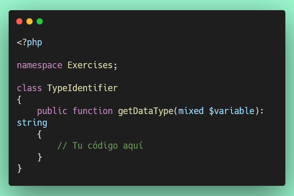
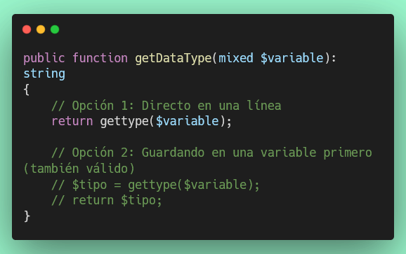
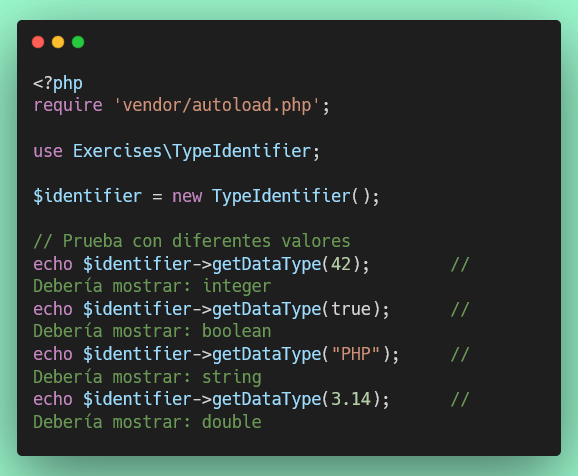

# Ejercicio 1: Identificación de Tipos de Datos (10 puntos)

## 🌐 Interfaz Web del Servidor

**Antes de comenzar**, puedes acceder a la interfaz web para monitorear tu progreso en tiempo real:

- **Dashboard Principal**: [http://localhost:8000](http://localhost:8000)
- **Resultados de Tests**: [http://localhost:8000/test-results.php](http://localhost:8000/test-results.php) (se actualiza automáticamente cada 30 segundos)
- **Información de PHP**: [http://localhost:8000/phpinfo.php](http://localhost:8000/phpinfo.php)

💡 **Tip**: Mantén abierta la página de resultados de tests en tu navegador mientras desarrollas para ver feedback inmediato.

---

## Objetivo

Aprender a identificar el tipo de dato de una variable usando la función `gettype()` de PHP.

## 📊 Puntuación

- **Puntos de este ejercicio**: 10
- **Puntos totales del proyecto**: 100

## Consideraciones

Este ejercicio cubre:

- Función `gettype()` para identificar tipos
- Tipos de datos en PHP: boolean, integer, double, string, array, object, NULL

**Documentación de referencia:** https://www.php.net/manual/es/function.gettype.php

## 📝 Guía Paso a Paso

### Paso 1: Crear el Archivo

1. Crea el archivo `/exercises/TypeIdentifier.php`
2. El archivo debe seguir esta estructura básica:



# Paso 2: Entender qué es `gettype()`

La función `gettype()` es una función incorporada de PHP que te dice el tipo de una variable:



### Paso 3: Implementar el Método

Tu tarea es muy simple: **usar `gettype()` y retornar su resultado**.


💡 **Tip**: ¡Es así de simple! Solo necesitas retornar lo que `gettype()` te devuelva.

### Paso 4: Probar tu Código Manualmente (Opcional)

Antes de ejecutar los tests, puedes probar tu código:



### Paso 5: Ejecutar los Tests

Una vez implementado, ejecuta los tests:

```bash
# Opción 1: Test específico de este ejercicio
./vendor/bin/phpunit tests/TypeIdentifierTest.php

# Opción 2: Todos los tests (si quieres ver el progreso general)
composer test
```

### Paso 6: Interpretar los Resultados

**✅ Si ves esto - ¡Éxito!**

```
OK (7 tests, 14 assertions)
```

**❌ Si ves errores:**

- Lee el mensaje de error cuidadosamente
- Verifica que hayas usado `gettype()`
- Asegúrate de que estés **retornando** el valor (no solo imprimiéndolo)
- Verifica que el archivo esté en la ubicación correcta: `exercises/TypeIdentifier.php`

## Instrucciones Resumidas

1. **Archivo de trabajo**: `/exercises/TypeIdentifier.php`
2. **Archivo de tests**: `/tests/TypeIdentifierTest.php`

3. **Implementar el método**:

   **Método `getDataType($variable): string`**
   - Usa la función `gettype($variable)`
   - Retorna el resultado directamente
   - ¡Eso es todo! No necesitas hacer nada más complejo.

## Estructura del Código (Plantilla)

```php
<?php

namespace Exercises;

class TypeIdentifier
{
    public function getDataType(mixed $variable): string
    {
        // TODO: Implementar usando gettype()
        return '';
    }
}
```

## 🧪 Casos de Prueba que Debes Pasar

El test verificará automáticamente estos casos:

| Entrada          | Salida Esperada | Explicación                                           |
| ---------------- | --------------- | ----------------------------------------------------- |
| `true`           | `"boolean"`     | Tipo boolean (verdadero/falso)                        |
| `42`             | `"integer"`     | Número entero                                         |
| `3.14`           | `"double"`      | Número decimal (gettype retorna "double" para floats) |
| `'PHP'`          | `"string"`      | Cadena de texto                                       |
| `[]`             | `"array"`       | Array vacío                                           |
| `new stdClass()` | `"object"`      | Objeto                                                |
| `null`           | `"NULL"`        | Valor nulo                                            |

## 🔍 Cómo Verificar tu Solución

### Opción 1: Tests Automáticos (Recomendado)

```bash
# Ejecutar solo este test
./vendor/bin/phpunit tests/TypeIdentifierTest.php

# Ver resultados con más detalles
./vendor/bin/phpunit tests/TypeIdentifierTest.php --testdox

# Ejecutar todos los tests del proyecto
composer test
```

### Opción 2: Interfaz Web

Abre en tu navegador: [http://localhost:8000/test-results.php](http://localhost:8000/test-results.php)

La página se actualiza automáticamente cada 30 segundos, o puedes hacer clic en "Ejecutar Tests".

## ✅ Criterios de Evaluación

Para obtener los **10 puntos**:

- ✅ El archivo `TypeIdentifier.php` debe existir en la carpeta `exercises/`
- ✅ La clase debe tener el namespace `Exercises`
- ✅ El método `getDataType()` debe usar la función `gettype()`
- ✅ Cada test que pase suma puntos parciales
- ✅ Todos los 7 tests deben pasar para obtener los 10 puntos completos

## 💡 Consejos y Ayuda

### ❓ ¿No sabes por dónde empezar?

1. **Crea el archivo primero**: `exercises/TypeIdentifier.php`
2. **Copia la estructura básica** (ver Paso 1 arriba)
3. **Implementa solo una línea**: `return gettype($variable);`
4. **Ejecuta el test**: `./vendor/bin/phpunit tests/TypeIdentifierTest.php`

### ❓ ¿Qué significa "mixed $variable"?

- `mixed` es un tipo especial en PHP 8+ que significa "puede ser cualquier tipo"
- Tu función recibirá diferentes tipos de datos (números, texto, arrays, etc.)
- No te preocupes por esto, solo usa `gettype()` con lo que recibas

### ❓ ¿Por qué gettype() retorna "double" y no "float"?

Por razones históricas, PHP usa "double" internamente para los números decimales, aunque en el código usamos `float`. Ambos términos se refieren a lo mismo.

### 🆘 Errores Comunes

**Error: "Class 'Exercises\TypeIdentifier' not found"**

- Solución: Asegúrate de que el archivo esté en `exercises/TypeIdentifier.php`
- Ejecuta: `composer dump-autoload`

**Error: Tests fallan pero no sabes por qué**

- Verifica que estés **retornando** el valor: `return gettype($variable);`
- NO uses `echo` o `print`, debes usar `return`

**Error: "Cannot declare class TypeIdentifier"**

- Ya existe un archivo con ese nombre o el namespace está mal
- Verifica: `namespace Exercises;` al inicio del archivo

## 📚 Recursos Adicionales

- [Documentación oficial de gettype()](https://www.php.net/manual/es/function.gettype.php)
- [Tipos de datos en PHP](https://www.php.net/manual/es/language.types.intro.php)
- [Guía de PHP para principiantes](https://www.php.net/manual/es/getting-started.php)

## 🎯 Siguiente Paso

Una vez que completes este ejercicio (10 puntos), continúa con:

- **Ejercicio 2**: Verificación de Tipos (20 puntos) - Aprende a usar `is_int()`, `is_string()`, etc.

---

💪 **¡Tú puedes hacerlo!** Este es un ejercicio introductorio muy sencillo. Si tienes dudas, revisa la documentación de gettype() o pregunta a tu instructor.
