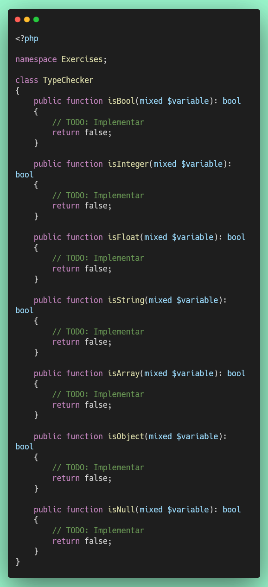

# Ejercicio 2: Verificación de Tipos de Datos (20 puntos)

## 🌐 Interfaz Web del Servidor

**Antes de comenzar**, puedes acceder a la interfaz web para monitorear tu progreso en tiempo real:

- **Dashboard Principal**: [http://localhost:8000](http://localhost:8000)
- **Resultados de Tests**: [http://localhost:8000/test-results.php](http://localhost:8000/test-results.php) (se actualiza automáticamente cada 30 segundos)
- **Información de PHP**: [http://localhost:8000/phpinfo.php](http://localhost:8000/phpinfo.php)

💡 **Tip**: Mantén abierta la página de resultados de tests en tu navegador mientras desarrollas para ver feedback inmediato.

---

## Objetivo

Aprender a verificar tipos de datos usando las funciones `is_*()` de PHP.

## 📊 Puntuación

- **Puntos de este ejercicio**: 20
- **Puntos totales del proyecto**: 100

## Consideraciones

Este ejercicio cubre las funciones de verificación de tipos:

- `is_bool()`, `is_int()`, `is_float()`, `is_string()`
- `is_array()`, `is_object()`, `is_null()`

**Documentación de referencia:** https://www.php.net/manual/es/ref.var.php

## Instrucciones

1. **Archivo de trabajo**: `/exercises/TypeChecker.php`
2. **Archivo de tests**: `/tests/TypeCheckerTest.php`

3. **Implementar los siguientes métodos**:

   **a) `isBool($variable): bool`**

   - Usa `is_bool($variable)` para verificar si es boolean
   - Retorna `true` si es bool, `false` si no lo es

   **b) `isInteger($variable): bool`**

   - Usa `is_int($variable)` para verificar si es entero
   - Retorna `true` si es int, `false` si no lo es

   **c) `isFloat($variable): bool`**

   - Usa `is_float($variable)` para verificar si es decimal
   - Retorna `true` si es float, `false` si no lo es

   **d) `isString($variable): bool`**

   - Usa `is_string($variable)` para verificar si es cadena de texto
   - Retorna `true` si es string, `false` si no lo es

   **e) `isArray($variable): bool`**

   - Usa `is_array($variable)` para verificar si es array
   - Retorna `true` si es array, `false` si no lo es

   **f) `isObject($variable): bool`**

   - Usa `is_object($variable)` para verificar si es objeto
   - Retorna `true` si es object, `false` si no lo es

   **g) `isNull($variable): bool`**

   - Usa `is_null($variable)` para verificar si es NULL
   - Retorna `true` si es null, `false` si no lo es

## Estructura del Código




## Ejemplos

```php
$checker = new TypeChecker();

$checker->isBool(true);      // true
$checker->isBool(1);          // false (es int, no bool)

$checker->isInteger(42);      // true
$checker->isInteger('42');    // false (es string, no int)

$checker->isString('PHP');    // true
$checker->isString(123);      // false
```

## Ejecución de Tests

```bash
# Ejecutar solo este test
./vendor/bin/phpunit tests/TypeCheckerTest.php

# Ejecutar todos los tests
composer test
```

## Criterios de Evaluación

- ✅ Uso correcto de todas las funciones `is_*()`
- ✅ Cada método que pase sus tests suma puntos parciales
- ✅ Todos los tests deben pasar para obtener los 20 puntos completos

## Recursos

- [Funciones de Variables en PHP](https://www.php.net/manual/es/ref.var.php)
- [is_bool()](https://www.php.net/manual/es/function.is-bool.php)
- [is_int()](https://www.php.net/manual/es/function.is-int.php)
