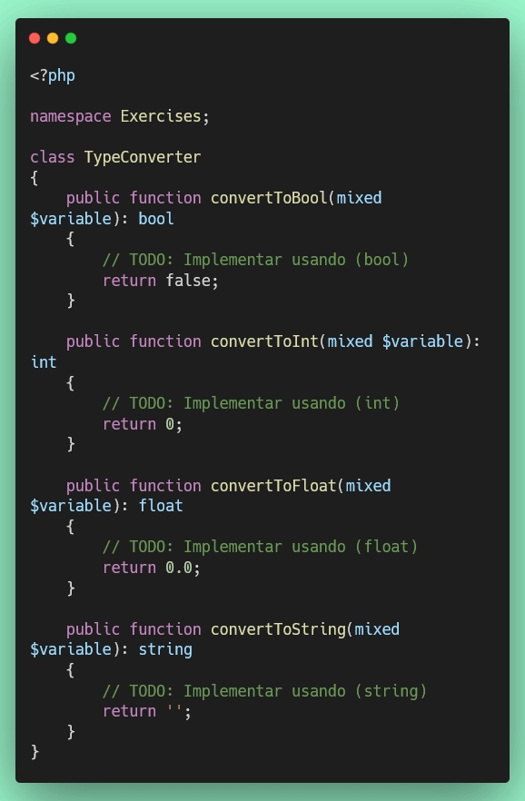

# Ejercicio 3: Conversión de Tipos (Type Casting) (20 puntos)

## 🌐 Interfaz Web del Servidor

**Antes de comenzar**, puedes acceder a la interfaz web para monitorear tu progreso en tiempo real:

- **Dashboard Principal**: [http://localhost:8000](http://localhost:8000)
- **Resultados de Tests**: [http://localhost:8000/test-results.php](http://localhost:8000/test-results.php) (se actualiza automáticamente cada 30 segundos)
- **Información de PHP**: [http://localhost:8000/phpinfo.php](http://localhost:8000/phpinfo.php)

💡 **Tip**: Mantén abierta la página de resultados de tests en tu navegador mientras desarrollas para ver feedback inmediato.

---

## Objetivo

Aprender a convertir variables entre diferentes tipos usando type casting en PHP.

## 📊 Puntuación

- **Puntos de este ejercicio**: 20
- **Puntos totales del proyecto**: 100

## Consideraciones

Este ejercicio cubre las conversiones de tipos:

- `(bool)` - Conversión a boolean
- `(int)` - Conversión a integer
- `(float)` - Conversión a float
- `(string)` - Conversión a string

**Documentación de referencia:** https://www.php.net/manual/es/language.types.type-juggling.php

## Instrucciones

1. **Archivo de trabajo**: `/exercises/TypeConverter.php`
2. **Archivo de tests**: `/tests/TypeConverterTest.php`

3. **Implementar los siguientes métodos**:

   **a) `convertToBool($variable): bool`**

   - Usa `(bool) $variable` para convertir a boolean
   - Valores que se convierten a `false`: `false`, `0`, `0.0`, `''`, `'0'`, `[]`, `null`
   - Todo lo demás se convierte a `true`

   **b) `convertToInt($variable): int`**

   - Usa `(int) $variable` para convertir a entero
   - Ejemplos: `(int) true` → `1`, `(int) 3.14` → `3`, `(int) '42'` → `42`

   **c) `convertToFloat($variable): float`**

   - Usa `(float) $variable` para convertir a decimal
   - Ejemplos: `(float) 42` → `42.0`, `(float) '3.14'` → `3.14`

   **d) `convertToString($variable): string`**

   - Usa `(string) $variable` para convertir a cadena
   - Ejemplos: `(string) 42` → `"42"`, `(string) true` → `"1"`, `(string) false` → `""`

## Estructura del Código




## Valores que se convierten a FALSE

- `boolean false`
- `integer 0`
- `float 0.0`
- `string ""` (cadena vacía)
- `string "0"`
- `array []` (array vacío)
- `NULL`

## Ejemplos de Conversiones

```php
// Boolean
(bool) 1;        // true
(bool) 0;        // false
(bool) "PHP";    // true
(bool) "";       // false
(bool) [];       // false

// Integer
(int) true;      // 1
(int) false;     // 0
(int) 3.14;      // 3
(int) "42";      // 42
(int) "42abc";   // 42

// Float
(float) 42;      // 42.0
(float) "3.14";  // 3.14

// String
(string) 42;     // "42"
(string) true;   // "1"
(string) false;  // ""
(string) null;   // ""
```

## Ejecución de Tests

```bash
# Ejecutar solo este test
./vendor/bin/phpunit tests/TypeConverterTest.php

# Ejecutar todos los tests
composer test
```

## Criterios de Evaluación

- ✅ Conversión correcta a boolean
- ✅ Conversión correcta a integer
- ✅ Conversión correcta a float
- ✅ Conversión correcta a string
- ✅ Cada método que pase sus tests suma puntos parciales
- ✅ Todos los tests deben pasar para obtener los 20 puntos completos

## Recursos

- [Type Juggling en PHP](https://www.php.net/manual/es/language.types.type-juggling.php)
- [Comparación de tipos](https://www.php.net/manual/es/types.comparisons.php)
