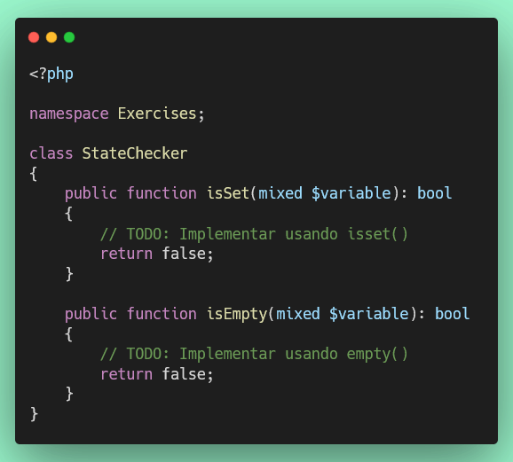
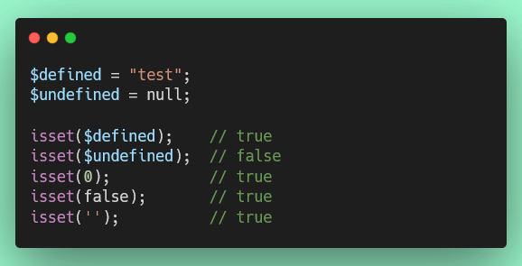

# Ejercicio 5: Verificación de Estado (isset/empty) (10 puntos)

## 🌐 Interfaz Web del Servidor

**Antes de comenzar**, puedes acceder a la interfaz web para monitorear tu progreso en tiempo real:

- **Dashboard Principal**: [http://localhost:8000](http://localhost:8000)
- **Resultados de Tests**: [http://localhost:8000/test-results.php](http://localhost:8000/test-results.php) (se actualiza automáticamente cada 30 segundos)
- **Información de PHP**: [http://localhost:8000/phpinfo.php](http://localhost:8000/phpinfo.php)

💡 **Tip**: Mantén abierta la página de resultados de tests en tu navegador mientras desarrollas para ver feedback inmediato.

---

## Objetivo

Aprender a usar `isset()` y `empty()` para verificar el estado de variables.

## 📊 Puntuación

- **Puntos de este ejercicio**: 10
- **Puntos totales del proyecto**: 100

## Consideraciones

Este ejercicio cubre:

- `isset()`: Verifica si una variable está definida y no es NULL
- `empty()`: Verifica si una variable está "vacía"

**Documentación de referencia:**

- https://www.php.net/manual/es/function.isset.php
- https://www.php.net/manual/es/function.empty.php

## Instrucciones

1. **Archivo de trabajo**: `/exercises/StateChecker.php`
2. **Archivo de tests**: `/tests/StateCheckerTest.php`

3. **Implementar los siguientes métodos**:

   **a) `isSet($variable): bool`**
   - Usa `isset($variable)` para verificar si está definida y no es NULL
   - Retorna `true` si la variable está definida y no es null
   - Retorna `false` si la variable es null o no está definida

   **b) `isEmpty($variable): bool`**
   - Usa `empty($variable)` para verificar si está vacía
   - Retorna `true` si la variable está "vacía"
   - Retorna `false` si la variable tiene un valor "no vacío"

## Estructura del Código



## ¿Qué valores considera `isset()`?

- `isset($var)` retorna `true` si la variable está definida y NO es `null`
- `isset($var)` retorna `false` si la variable es `null` o no existe



## ¿Qué valores considera `empty()`?

`empty()` retorna `true` para:

- `false`
- `0`
- `0.0`
- `""`
- `"0"`
- `[]`
- `null`

`empty()` retorna `false` para valores "no vacíos":

- `true`
- `1`
- `"PHP"`
- `[1, 2, 3]`

```php
empty('');          // true
empty(0);           // true
empty(false);       // true
empty('PHP');       // false
empty(1);           // false
empty([1, 2]);      // false
```

## Diferencia entre isset() y empty()

```php
$var = 0;

isset($var);   // true (está definida)
empty($var);   // true (0 se considera vacío)

$var = null;

isset($var);   // false (null no está "set")
empty($var);   // true (null está vacío)
```

## Ejecución de Tests

```bash
# Ejecutar solo este test
./vendor/bin/phpunit tests/StateCheckerTest.php

# Ejecutar todos los tests
composer test
```

## Criterios de Evaluación

- ✅ Uso correcto de `isset()`
- ✅ Uso correcto de `empty()`
- ✅ Comprensión de la diferencia entre ambas funciones
- ✅ Cada método que pase sus tests suma puntos parciales
- ✅ Todos los tests deben pasar para obtener los 10 puntos completos

## Recursos

- [isset() en PHP](https://www.php.net/manual/es/function.isset.php)
- [empty() en PHP](https://www.php.net/manual/es/function.empty.php)
- [Tabla de comparaciones de tipos](https://www.php.net/manual/es/types.comparisons.php)
