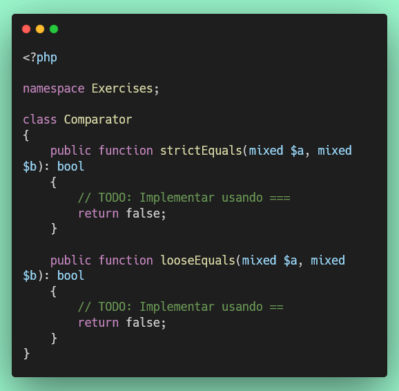
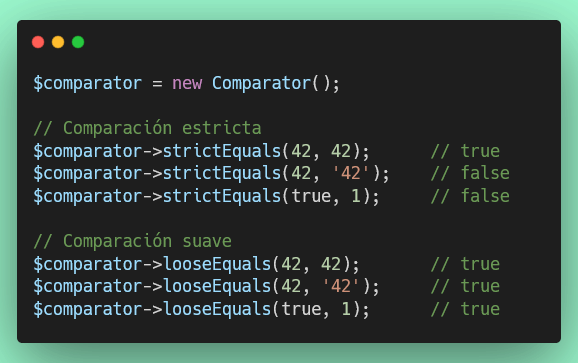

# Ejercicio 6: Comparaciones (== vs ===) (10 puntos)

## 🌐 Interfaz Web del Servidor

**Antes de comenzar**, puedes acceder a la interfaz web para monitorear tu progreso en tiempo real:

- **Dashboard Principal**: [http://localhost:8000](http://localhost:8000)
- **Resultados de Tests**: [http://localhost:8000/test-results.php](http://localhost:8000/test-results.php) (se actualiza automáticamente cada 30 segundos)
- **Información de PHP**: [http://localhost:8000/phpinfo.php](http://localhost:8000/phpinfo.php)

💡 **Tip**: Mantén abierta la página de resultados de tests en tu navegador mientras desarrollas para ver feedback inmediato.

---

## Objetivo

Aprender la diferencia entre comparación estricta (===) y comparación suave (==) en PHP.

## 📊 Puntuación

- **Puntos de este ejercicio**: 10
- **Puntos totales del proyecto**: 100

## Consideraciones

Este ejercicio cubre:

- `===` Comparación estricta (valor Y tipo deben ser iguales)
- `==` Comparación suave (solo el valor debe ser igual, con conversión automática)

**Documentación de referencia:** https://www.php.net/manual/es/language.operators.comparison.php

## Instrucciones

1. **Archivo de trabajo**: `/exercises/Comparator.php`
2. **Archivo de tests**: `/tests/ComparatorTest.php`

3. **Implementar los siguientes métodos**:

   **a) `strictEquals($a, $b): bool`**
   - Usa `$a === $b` para comparación estricta
   - Retorna `true` solo si el valor Y el tipo son iguales
   - Ejemplo: `42 === 42` → `true`, pero `42 === '42'` → `false`

   **b) `looseEquals($a, $b): bool`**
   - Usa `$a == $b` para comparación suave
   - Retorna `true` si los valores son iguales después de conversión de tipos
   - Ejemplo: `42 == '42'` → `true`

## Estructura del Código



## Diferencia entre == y ===

### Comparación Estricta (===)

Compara **valor Y tipo**:

```php
42 === 42        // true (mismo valor y tipo)
42 === '42'      // false (diferente tipo)
true === 1       // false (diferente tipo)
false === 0      // false (diferente tipo)
null === ''      // false (diferente tipo)
```

### Comparación Suave (==)

Compara **solo valor** (con conversión automática):

```php
42 == 42         // true (mismo valor)
42 == '42'       // true (PHP convierte '42' a 42)
true == 1        // true (PHP convierte true a 1)
false == 0       // true (PHP convierte false a 0)
null == ''       // true (ambos son "vacíos")
```

## Tabla de Comparaciones

| Comparación    | == (suave) | === (estricta) |
| -------------- | ---------- | -------------- |
| `42` vs `42`   | ✅ true    | ✅ true        |
| `42` vs `'42'` | ✅ true    | ❌ false       |
| `true` vs `1`  | ✅ true    | ❌ false       |
| `false` vs `0` | ✅ true    | ❌ false       |
| `null` vs `''` | ✅ true    | ❌ false       |
| `0` vs `'0'`   | ✅ true    | ❌ false       |

## ¿Cuándo usar cada una?

### Usa === (estricta) cuando:

- Necesitas verificar el tipo exacto
- Comparas con `true`, `false`, o `null`
- Quieres evitar conversiones inesperadas
- **Recomendación**: Usa === por defecto en tu código

### Usa == (suave) cuando:

- Intencionalmente quieres ignorar el tipo
- Comparas input de usuarios (que suele ser string)
- Sabes exactamente qué conversión ocurrirá

## Ejemplos Prácticos



## Ejecución de Tests

```bash
# Ejecutar solo este test
./vendor/bin/phpunit tests/ComparatorTest.php

# Ejecutar todos los tests
composer test
```

## Criterios de Evaluación

- ✅ Uso correcto del operador `===`
- ✅ Uso correcto del operador `==`
- ✅ Comprensión de la diferencia entre ambos tipos de comparación
- ✅ Cada método que pase sus tests suma puntos parciales
- ✅ Todos los tests deben pasar para obtener los 10 puntos completos

## Recursos

- [Operadores de Comparación](https://www.php.net/manual/es/language.operators.comparison.php)
- [Tabla de Comparaciones de Tipos](https://www.php.net/manual/es/types.comparisons.php)
- [PSR-12: Usar === en lugar de ==](https://www.php-fig.org/psr/psr-12/)
