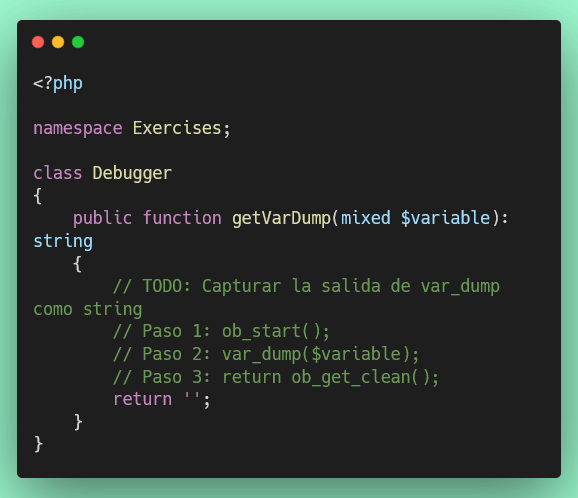
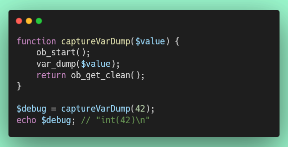

# Ejercicio 7: Debugging con var_dump() (5 puntos)

## 🌐 Interfaz Web del Servidor

**Antes de comenzar**, puedes acceder a la interfaz web para monitorear tu progreso en tiempo real:

- **Dashboard Principal**: [http://localhost:8000](http://localhost:8000)
- **Resultados de Tests**: [http://localhost:8000/test-results.php](http://localhost:8000/test-results.php) (se actualiza automáticamente cada 30 segundos)
- **Información de PHP**: [http://localhost:8000/phpinfo.php](http://localhost:8000/phpinfo.php)

💡 **Tip**: Mantén abierta la página de resultados de tests en tu navegador mientras desarrollas para ver feedback inmediato.

---

## Objetivo

Aprender a usar `var_dump()` para debugging y capturar su salida como string.

## 📊 Puntuación

- **Puntos de este ejercicio**: 5
- **Puntos totales del proyecto**: 100

## Consideraciones

Este ejercicio cubre:

- `var_dump()`: Función de debugging que muestra tipo y valor
- Output buffering: `ob_start()`, `ob_get_clean()`

**Documentación de referencia:**

- https://www.php.net/manual/es/function.var-dump.php
- https://www.php.net/manual/es/ref.outcontrol.php

## Instrucciones

1. **Archivo de trabajo**: `/exercises/Debugger.php`
2. **Archivo de tests**: `/tests/DebuggerTest.php`

3. **Implementar el siguiente método**:

   **Método `getVarDump($variable): string`**
   - QUÉ HACER: Captura la salida de `var_dump($variable)` como string
   - CÓMO HACERLO:
     1. Inicia el buffer de salida con `ob_start()`
     2. Llama a `var_dump($variable)`
     3. Captura y retorna el contenido con `ob_get_clean()`

## Estructura del Código



## ¿Qué es var_dump()?

`var_dump()` es una función de debugging que muestra:

- El tipo de la variable
- Su valor
- Para estructuras complejas, muestra toda la información

```php
var_dump(42);
// Output: int(42)

var_dump("PHP");
// Output: string(3) "PHP"

var_dump(true);
// Output: bool(true)

var_dump([1, 2, 3]);
// Output: array(3) { [0]=> int(1) [1]=> int(2) [2]=> int(3) }
```

## ¿Qué es Output Buffering?

Por defecto, `var_dump()` imprime directamente a la salida. Para capturar su output como string:

```php
// Iniciar el buffer
ob_start();

// Cualquier output va al buffer en lugar de imprimirse
var_dump(42);

// Obtener el contenido del buffer y limpiarlo
$output = ob_get_clean();

echo $output; // "int(42)\n"
```

## Ejemplo Completo



## Casos de Prueba

El test verificará:

- `getVarDump(42)` contiene `"int(42)"`
- `getVarDump("PHP")` contiene `"string(3) \"PHP\""`
- `getVarDump(true)` contiene `"bool(true)"`

## Ejecución de Tests

```bash
# Ejecutar solo este test
./vendor/bin/phpunit tests/DebuggerTest.php

# Ejecutar todos los tests
composer test
```

## Uso Práctico de var_dump()

En desarrollo real, `var_dump()` es útil para:

```php
// Debugging de variables
$data = ['user' => 'John', 'age' => 30];
var_dump($data);

// Ver el tipo exacto de una variable
$value = "123";
var_dump($value); // string(3) "123" (no es int!)

// Verificar el contenido de objetos
$obj = new stdClass();
$obj->name = "Test";
var_dump($obj);
```

## Criterios de Evaluación

- ✅ Uso correcto de `ob_start()`
- ✅ Uso correcto de `var_dump()`
- ✅ Uso correcto de `ob_get_clean()`
- ✅ La función retorna el output capturado como string
- ✅ Cada test que pase suma puntos parciales
- ✅ Todos los tests deben pasar para obtener los 5 puntos completos

## Recursos

- [var_dump()](https://www.php.net/manual/es/function.var-dump.php)
- [Output Control](https://www.php.net/manual/es/ref.outcontrol.php)
- [ob_start()](https://www.php.net/manual/es/function.ob-start.php)
- [ob_get_clean()](https://www.php.net/manual/es/function.ob-get-clean.php)
